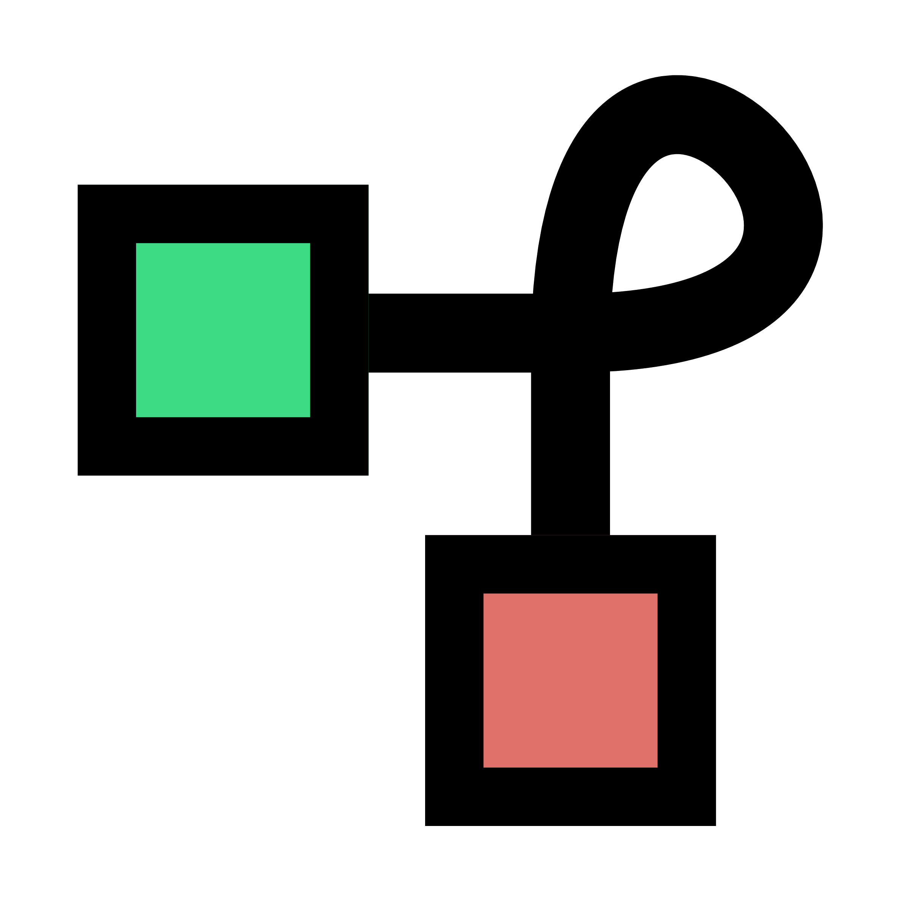

<p align="center">
  <picture>
    <source
      media="(prefers-color-scheme: dark)"
      srcset="assets/bowline-icon-dark.png"
    />
    
  </picture>
</p>

# Bowline

Bowline keeps one developer workspace available across all your machines and
coding agents. You work in `~/Code` like a normal local folder, and Bowline
handles device trust, workspace sync, generated-file policy, and agent work
isolation underneath.

This repository holds Bowline's public client and runtime source. It's a
generated export from a private canonical repo, meant for release builds,
audits, and contributions to the public client. It leaves out private product
notes, hosted deployment wiring, credentials, research packets, and unreleased
plans by design.

## Install

On Apple Silicon macOS and Linux x86_64:

```bash
curl -fsSL https://install.bowline.sh | sh
```

On macOS, this installs `Bowline.app`, `bowline`, and `bowline-daemon`. On
Linux, it installs `bowline` and `bowline-daemon` into `~/.local/bin`.

For CLI-only installs on macOS:

```bash
curl -fsSL https://install.bowline.sh | sh -s -- --cli-only
```

If you prefer Homebrew:

```bash
brew install bowline-sh/tap/bowline
```

Verify the install:

```bash
bowline --version
bowline-daemon --version
```

## First machine

Create or adopt your workspace:

```bash
bowline login --root ~/Code
bowline status
```

`bowline login` opens the account flow, creates the workspace if needed, and
trusts the first device. `bowline status` shows sync state, pending device
approvals, agent work, and recovery actions.

## Second machine

Install Bowline on the second machine, then run:

```bash
bowline login --root ~/Code
bowline status
```

When prompted, approve the new device from a machine you already trust. After
approval, edits under `~/Code` sync through the hosted control plane and object
store. Generated folders such as `node_modules` stay local by default.

## Agent work

Agents work through leases instead of writing directly into the live workspace:

```bash
bowline agent lease create ~/Code/my-project --task "describe the work"
bowline work list
```

A lease gives an agent a scoped workspace, a hydration budget, freshness checks,
and a review path before changes land back in the main project.

## Build from source

You need pnpm and a Rust toolchain installed. Then build the release binaries:

```bash
pnpm install --frozen-lockfile
pnpm verify:public
cargo build --release -p bowline -p bowline-daemon
```

The release binaries are:

- `target/release/bowline`
- `target/release/bowline-daemon`

## Repository boundary

The public repo is a generated export of Bowline's private canonical repo. Don't
add private deployment config, raw env files, internal plans, transcripts, or
research material here. Make public source changes in the canonical repo, then
export them.
